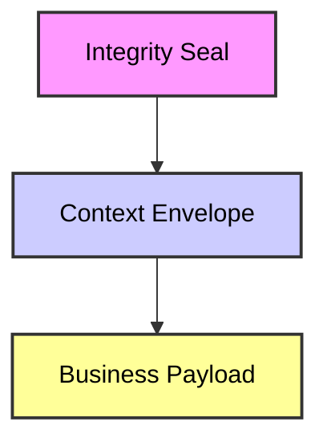
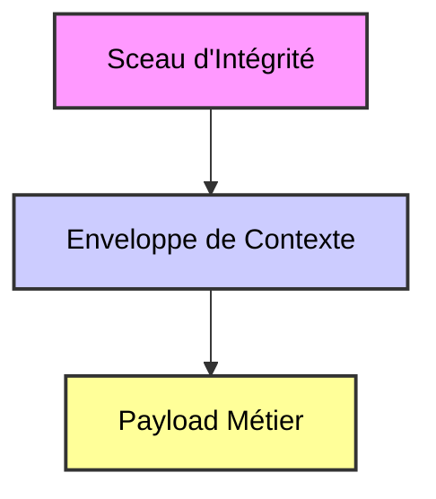

### [EN]

# **Technical Focus: The Decision Snapshot Anatomy**

## **The Atomic Unit of Institutional Evidence**

---

### **Introduction**

The **Decision Snapshot** is the immutable, self-contained artifact produced by Horizon at the exact moment of execution ().

Unlike application logs, which are mutable streams of operational data designed for debugging, a Decision Snapshot is a **cryptographically sealed institutional declaration**. It is designed to sustain hostile forensic scrutiny years after the originating system has been decommissioned.

This document outlines the logical structure and technical properties of this atomic unit of evidence.

---

### **1. Logical Structure: The Cryptographic Onion**

A Decision Snapshot is composed of three inseparable layers. The outer layers provide context and security to the inner raw data, forming a single, verifiable object.

#### **Layer A: The Business Payload (The "What")**

This is the raw, untouched evidence. Horizon captures the inputs consumed and the outputs produced by the decision engine at the point of no return.

* **Data Purity:** The payload is captured *verbatim*. Horizon performs no transformation, normalization, or enrichment on this layer.
* **Schema Agnostic:** The structure of the payload is defined entirely by the client institution’s business logic.

#### **Layer B: The Context Envelope (The "When, Where, Who")**

This layer provides the standardized metadata required for indexing, retrieval, and governance.

* **Global Decision ID:** A unique, collision-resistant identifier for the execution event.
* **Accurate Timestamp ():** A high-precision timestamp captured at the instant of execution, synchronized with reliable time sources.
* **System Reference (`System_Ref`):** A critical identifier specifying the exact version of the logic, model, or policy in authority (e.g., `credit-scoring-engine-v4.2.1-beta`).

#### **Layer C: The Integrity Seal (The "Proof")**

The outermost layer is a cryptographic signature that binds the Envelope and the Payload together.

* **Mechanism:** The contents of Layers A and B are serialized canonically and hashed using a strong algorithm (e.g., SHA-256). This hash is then signed using the institution's private key.
* **Guarantee:** Any alteration to a single bit within the Payload or Context will result in a mismatch during hash re-computation, immediately invalidating the seal.

---

### **2. Key Technical Properties**

#### **Canonical Serialization**

To ensure repeatable hashing across different systems and languages, snapshots employ canonical serialization. This guarantees that the logical order of data fields does not affect the resulting cryptographic hash, preventing false positives during verification.

#### **Cryptographic Chaining**

Snapshots are not isolated islands. Each new snapshot's Integrity Seal incorporates the hash of the preceding snapshot's seal.

* **Outcome:** This creates an unbroken chronological chain (similar to a Merkle chain or blockchain structure).
* **Security implication:** It becomes computationally infeasible to insert, delete, or reorder a decision record in the past without breaking the chain of custody for all subsequent records.

#### **Self-Containment & Portability**

A snapshot is designed to be verifiable "offline." It contains all the necessary context within its envelope. An auditor does not need access to the original production database to verify what data was used in a decision five years prior.

---

### **3. The Verification Model (Sovereign) - Why it works**

The verification process is designed to be autonomous and standard-based. It does not rely on Asplenz proprietary technology to prove the truth.

1. **Public Key Availability:** The institution publishes the Public Key corresponding to the Private Key used for signing by Horizon (stored in an HSM or secure vault).
2. **Standard computation:** A verifier (internal audit tool, regulator script) takes the Snapshot object.
3. **Re-Hashing:** It separates the seal from the content, canonically serializes the content, and computes the hash.
4. **Signature Validation:** It uses the Public Key to decrypt the Integrity Seal and compares the two hashes. If they match, the evidence is mathematically proven to be authentic and unaltered.

---

---

---

### [FR]

# **Focus Technique : Anatomie du Snapshot Décisionnel**

## **L'Unité Atomique de Preuve Institutionnelle**

---

### **Introduction**

Le **Snapshot Décisionnel** est l'artéfact immuable et auto-contenu produit par Horizon au moment exact de l'exécution ().

Contrairement aux logs applicatifs, qui sont des flux de données opérationnelles mutables conçus pour le débogage, un Snapshot Décisionnel est une **déclaration institutionnelle scellée cryptographiquement**. Il est conçu pour résister à un examen médico-légal hostile des années après la mise hors service du système d'origine.

Ce document présente la structure logique et les propriétés techniques de cette unité atomique de preuve.

---

### **1. Structure Logique : L'Oignon Cryptographique**

Un Snapshot Décisionnel est composé de trois couches inséparables. Les couches externes fournissent le contexte et la sécurité aux données brutes internes, formant un objet unique et vérifiable.

#### **Couche A : Le Payload Métier (Le "Quoi")**

C'est la preuve brute, intacte. Horizon capture les entrées consommées et les sorties produites par le moteur de décision au point de non-retour.

* **Pureté des Données :** Le payload est capturé *verbatim*. Horizon n'effectue aucune transformation, normalisation ou enrichissement sur cette couche.
* **Agnostique au Schéma :** La structure du payload est entièrement définie par la logique métier de l'institution cliente.

#### **Couche B : L'Enveloppe de Contexte (Le "Quand, Où, Qui")**

Cette couche fournit les métadonnées standardisées nécessaires à l'indexation, à la récupération et à la gouvernance.

* **ID de Décision Global :** Un identifiant unique et résistant aux collisions pour l'événement d'exécution.
* **Horodatage Précis () :** Un horodatage de haute précision capturé à l'instant de l'exécution, synchronisé avec des sources de temps fiables.
* **Référence Système (`System_Ref`) :** Un identifiant critique spécifiant la version exacte de la logique, du modèle ou de la politique faisant autorité (ex: `moteur-score-credit-v4.2.1-beta`).

#### **Couche C : Le Sceau d'Intégrité (La "Preuve")**

La couche la plus externe est une signature cryptographique qui lie l'Enveloppe et le Payload ensemble.

* **Mécanisme :** Le contenu des Couches A et B est sérialisé de manière canonique et haché à l'aide d'un algorithme fort (ex: SHA-256). Ce hachage est ensuite signé à l'aide de la clé privée de l'institution.
* **Garantie :** Toute altération d'un seul bit dans le Payload ou le Contexte entraînera une non-correspondance lors du re-calcul du hachage, invalidant immédiatement le sceau.

---

### **2. Propriétés Techniques Clés**

#### **Sérialisation Canonique**

Pour garantir un hachage répétable entre différents systèmes et langages, les snapshots utilisent une sérialisation canonique. Cela garantit que l'ordre logique des champs de données n'affecte pas le hachage cryptographique résultant, évitant les faux positifs lors de la vérification.

#### **Chaînage Cryptographique**

Les snapshots ne sont pas des îlots isolés. Le Sceau d'Intégrité de chaque nouveau snapshot intègre le hachage du sceau du snapshot précédent.

* **Résultat :** Cela crée une chaîne chronologique ininterrompue (similaire à une structure de chaîne de Merkle ou blockchain).
* **Implication de sécurité :** Il devient informatiquement infaisable d'insérer, de supprimer ou de réorganiser un enregistrement de décision dans le passé sans briser la chaîne de contrôle pour tous les enregistrements ultérieurs.

#### **Auto-contenance et Portabilité**

Un snapshot est conçu pour être vérifiable "hors ligne". Il contient tout le contexte nécessaire dans son enveloppe. Un auditeur n'a pas besoin d'accéder à la base de données de production d'origine pour vérifier quelles données ont été utilisées dans une décision cinq ans auparavant.

---

### **3. Le Modèle de Vérification (Souverain) - Pourquoi ça marche**

Le processus de vérification est conçu pour être autonome et basé sur des standards. Il ne dépend pas d'une technologie propriétaire Asplenz pour prouver la vérité.

1. **Disponibilité de la Clé Publique :** L'institution publie la Clé Publique correspondant à la Clé Privée utilisée pour la signature par Horizon (stockée dans un HSM ou un coffre-fort sécurisé).
2. **Calcul standard :** Un vérificateur (outil d'audit interne, script du régulateur) prend l'objet Snapshot.
3. **Re-Hachage :** Il sépare le sceau du contenu, sérialise le contenu de manière canonique et calcule le hachage.
4. **Validation de Signature :** Il utilise la Clé Publique pour déchiffrer le Sceau d'Intégrité et compare les deux hachages. S'ils correspondent, il est mathématiquement prouvé que la preuve est authentique et non altérée.

