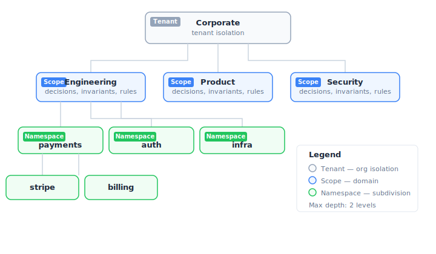

<!-- lang: fr -->

# Comment fonctionne Knowledge

Knowledge est un registre de décisions qui connecte humains, agents IA et pipelines CI à une source de vérité unique pour les contraintes organisationnelles.

---

## L'idée centrale

Les organisations prennent des décisions. Ces décisions produisent des contraintes. Ces contraintes doivent être appliquées. Aujourd'hui, les décisions vivent dans des wikis, les contraintes dans la tête des gens, et l'application est manuelle. Knowledge change ça en extrayant ce qui existe déjà, en structurant les décisions, en rendant les contraintes lisibles par les machines, et en automatisant leur application.

---

## Quatre types d'entrées, un seul registre

### Decisions

Une **decision** est un fait historique — ce qui a été décidé, par qui, quand, et pourquoi. Les decisions sont immuables : une fois enregistrées, elles ne peuvent pas être modifiées. L'historique est préservé exactement tel qu'il a été capturé.

```json
{
  "decision": "Utiliser PostgreSQL pour tous les data stores transactionnels",
  "context": "Évaluation de PostgreSQL, DynamoDB et CockroachDB",
  "reasoning": "Garanties ACID sans complexité distribuée",
  "author": "sarah.chen",
  "tags": ["database", "infrastructure"]
}
```

Les decisions répondent à la question : **« Pourquoi cette règle existe-t-elle ? »**

### Invariants

Un **invariant** est une contrainte absolue — quelque chose qui ne doit jamais être violé. Les invariants sont bloquants : si une action entre en conflit avec un invariant, l'action est stoppée.

```json
{
  "constraint": "Tous les endpoints API publics doivent exiger une authentification",
  "rationale": "Baseline sécurité — aucune exception sans approbation explicite",
  "requires_approval": true
}
```

Les invariants répondent à la question : **« Qu'est-ce qui ne doit jamais arriver ? »**

### Rules

Une **rule** est une directive active — quelque chose qui doit être suivi. Les rules sont versionnées : quand les exigences changent, une nouvelle version est créée tandis que l'historique est préservé.

Les rules ont deux niveaux de sévérité :
- **Mandatory** : doit être suivie ; les violations bloquent les checks CI
- **Advisory** : devrait être suivie ; les violations génèrent des avertissements

```json
{
  "directive": "Toutes les PRs doivent être revues par au moins un membre de l'équipe",
  "severity": "MANDATORY"
}
```

Les rules répondent à la question : **« Que devons-nous faire ? »**

### Overrides

Un **override** est une exception gouvernée — une dérogation explicite et approuvée à une rule ou un invariant. Les overrides ne sont pas des contournements. Ce sont des preuves documentées que l'organisation a reconnu une contrainte, décidé d'y déroger, et enregistré pourquoi.

```json
{
  "target": "rule:rul-9c2a",
  "justification": "Le gateway de paiement legacy nécessite REST — migration gRPC prévue au Q3",
  "conditions": "S'applique uniquement au service payment-gateway-v2",
  "expires": "2026-09-30",
  "approved_by": "sarah.chen"
}
```

Les overrides répondent à la question : **« Pourquoi cette règle n'a-t-elle pas été suivie ? »**

### Comment les types travaillent ensemble

Les quatre types ne sont pas interchangeables — chacun a un rôle distinct dans le cycle de vie du knowledge :

```
1. CAPTURE     Quelqu'un dit "on prend PostgreSQL"
               → Decision enregistrée (fait historique, immuable)

2. STRUCTURE   L'équipe en dérive une directive opérationnelle
               → Rule créée : "Tout nouveau service transactionnel doit utiliser PostgreSQL"
               → Invariant créé : "Pas de base NoSQL pour les données transactionnelles"

3. ENFORCE     Un agent veut créer un service avec MongoDB
               → knowledge_check → BLOQUÉ par l'invariant
               → L'agent explique POURQUOI en citant la decision d'origine

4. EXCEPTION   Le service legacy a besoin de MongoDB temporairement
               → Override créé avec justification, conditions et date d'expiration
```

| Type | Rôle | Qui le produit | Qui le consomme |
|------|------|---------------|-----------------|
| **Decision** | Mémoire — le *pourquoi* | Humains (via bot, dashboard, agent) | Humains (audit, contexte), agents (explication) |
| **Invariant** | Garde-fou — le *jamais* | Humains (après réflexion) | Agents et CI (enforcement bloquant) |
| **Rule** | Directive — le *comment* | Humains (dérivé des decisions) | Agents et CI (enforcement, advisory ou mandatory) |
| **Override** | Exception — le *malgré tout* | Humains (avec approbation) | Agents et CI (dérogation temporaire) |

Sans les decisions, les rules n'ont pas de provenance. Sans les rules, les decisions ne sont pas appliquées. Sans les overrides, le système est rigide. Les quatre types forment un cycle complet : **capturer → structurer → appliquer → tracer**.

---

## Comment les entrées se connectent

Les entités sont liées entre elles par des relations typées :


Exemples de types de relations : `depends_on`, `supersedes`, `replaces`, `contradicts`, `in_tension_with`.

Ce graphe signifie qu'on peut toujours remonter au *pourquoi* d'une contrainte — il suffit de suivre les liens jusqu'à la decision.

---

## Scopes et organisation

Knowledge est organisé en **scopes** — des domaines comme Engineering, Product, Operations ou Security. Chaque scope contient ses propres decisions, invariants et rules. Au sein d'un scope, les **namespaces** permettent une subdivision plus fine (ex : `payments`, `auth`, `infra`).



Pour les organisations multi-entités, les **tenants** assurent l'isolation. Un groupe peut avoir des tenants par filiale, chacun avec ses propres scopes et entrées.

---

## Partez de ce que vous avez déjà

La plupart des équipes ont déjà des règles — elles ne sont simplement pas structurées. Elles vivent dans des READMEs, des docs d'architecture, des runbooks, des commentaires de code et des fichiers CLAUDE.md. Knowledge les extrait automatiquement.

### Extraction automatique

La CLI `knowledge extract` scanne vos sources et utilise une analyse LLM pour faire émerger les règles, décisions et contraintes implicites :

```bash
knowledge extract --scope Engineering --namespace payments --source ./docs --source ./README.md
```

Le LLM analyse le contenu et identifie :

- **Candidats invariant** : contraintes absolues (« Tous les endpoints doivent exiger une authentification »)
- **Candidats rule** : directives actives (« Utiliser les conventional commits »)
- **Candidats decision** : choix historiques avec contexte (« On a choisi PostgreSQL pour... »)

Chaque extraction inclut un score de confiance, l'extrait source qui l'a motivée, et des tags suggérés.

### Validation humaine

Rien n'est publié sans validation humaine. Chaque extraction devient un **draft** dans la file de revue. Les reviewers voient le contexte source, le niveau de confiance, et les relations détectées avec les entrées existantes. Trois actions : **Approuver**, **Rejeter** ou **Éditer**.

### Déduplication sémantique

Le pipeline compare chaque candidat aux entrées existantes. Les doublons exacts sont éliminés silencieusement, les quasi-doublons signalés pour que les reviewers décident. Vous pouvez ré-extraire régulièrement sans risque de doublons.

### API d'ingestion

Pour les sources qui ne sont pas sur disque — exports Confluence, digests Slack, wikis internes, artefacts CI — l'API REST permet de pousser des documents directement dans le pipeline d'extraction.

---

## Six interfaces, une seule source de vérité

### CLI

Les développeurs extraient les règles de la documentation existante, lancent le pipeline d'extraction et gèrent le registre depuis le terminal. La CLI supporte les glob patterns, plusieurs types de sources et le ciblage par scope.

### Dashboard web

Les humains parcourent les scopes, lisent les decisions, passent en revue les drafts et approbations, et recherchent dans le registre. Le dashboard affiche :
- Cartes KPI (compteurs d'entrées par type)
- Drafts d'extraction avec workflow approuver/rejeter
- Pages scope avec onglets (Decisions, Invariants, Rules, Overrides, Approvals, Events, References)
- Recherche full-text avec filtres type/scope
- Vérificateur de conformité (tester une action envisagée contre les contraintes)

### API REST

L'API REST est l'interface programmatique directe au registre. Toutes les autres interfaces (CLI, MCP, Bot, Verifier) sont des clients de cette API. Les équipes peuvent l'utiliser directement pour intégrer Knowledge dans n'importe quel workflow ou outil interne.

```bash
# Lister les invariants d'un scope
curl http://localhost:8090/api/v1/invariants?scope_id=scp-... \
  -H "Authorization: Bearer kn_..."

# Vérifier la conformité d'une action
curl -X POST http://localhost:8090/api/v1/check \
  -H "Authorization: Bearer kn_..." \
  -d '{"scope_id": "scp-...", "intended_action": "Déployer vendredi soir"}'
```

L'API couvre la totalité des opérations : lecture, écriture, recherche, extraction, vérification de conformité et gestion des approbations. Authentification par clé API (`Authorization: Bearer kn_...`), permissions granulaires par clé.

### MCP pour les agents IA

Les agents IA (Claude, Cursor, etc.) se connectent via MCP et interagissent en langage naturel. Knowledge expose un ensemble d'outils que les agents appellent avant, pendant et après leurs actions.

**Vérifier avant d'agir :**

```
Utilisateur : "Est-ce que je peux déployer vendredi soir ?"
Agent → knowledge_check(scope="Engineering", intended_action="Déployer vendredi soir")
Knowledge → Conflit : invariant inv-8a3f "Pas de déploiement le vendredi après 16h UTC"
Agent : "Non — bloqué par l'invariant inv-8a3f. L'équipe a une politique no-deploy le vendredi."
```

**Résoudre le contexte avant de coder :**

```
L'agent démarre une tâche dans le namespace payments
Agent → knowledge_resolve(scope="Engineering", namespace="payments")
Knowledge → Retourne 14 entrées applicables : 2 invariants, 5 decisions, 6 rules, 1 override
L'agent sait maintenant : PostgreSQL obligatoire, pas de dépendances AGPL, gRPC pour les nouveaux
  services, override REST actif pour payment-gateway-v2
```

**Enregistrer une décision après l'avoir prise :**

```
Utilisateur : "On prend Redis pour le cache de sessions plutôt que Memcached"
Agent → knowledge_record(scope="Engineering", type="decision",
        decision="Redis pour le cache de sessions",
        reasoning="Pub/sub natif, meilleures options de persistance")
Knowledge → Créé dec-4f2a, lié à la rule existante rul-7b1c (stratégie de cache)
```

Les agents peuvent chercher, vérifier la conformité, résoudre le contexte applicable, enregistrer des decisions, demander des approbations et enregistrer des traces d'usage — le tout via le même protocole.

Quand un agent demande une approbation, Knowledge peut notifier les personnes concernées via **webhook** (Slack, Teams, ou tout système externe) avec une signature ECDSA pour garantir l'authenticité. L'agent peut fournir un `callback_url` pour être notifié automatiquement quand l'approbation est traitée — sans polling.

### Bot Slack & Teams

Le Knowledge Bot surveille un canal dédié (`#knowledge`) et détecte automatiquement les décisions, invariants et règles dans les messages de votre équipe. Quand un message contient du knowledge, le bot poste un résumé structuré dans le thread avec des boutons **Valider**, **Éditer** ou **Ignorer**.

```
Message dans #knowledge :
  "On interdit les déploiements le vendredi après 16h à partir de maintenant"

Bot → Détecte un invariant (confiance : 0.94)
  → Poste dans le thread :
    Type : Invariant
    Contrainte : "Pas de déploiement le vendredi après 16h UTC"
    Scope : Engineering (modifiable via dropdown)
    → [Valider] [Éditer] [Ignorer]

L'utilisateur clique [Valider] → l'entrée est publiée dans le registre
```

Le bot supporte aussi le transfert de messages : une décision prise dans `#engineering` peut être transférée dans `#knowledge` pour capture. Le bot fonctionne via Socket Mode (Slack) ou HTTP (Teams) — pas d'URL publique requise pour Slack.

### Verifier CI/CD

Le Verifier s'exécute dans votre pipeline CI et vérifie que chaque PR cite les entrées Knowledge applicables :

**Une PR qui passe :**

```
PR #142 : "Ajouter un endpoint de health"
  → Le Verifier résout le scope Engineering
  → Trouve 3 invariants applicables, 2 rules mandatory
  → Le corps de la PR cite les 5 avec statut : "followed"
  → Verdict : PASS ✓
```

**Une PR qui échoue :**

```
PR #143 : "Ajouter une librairie PDF sous licence AGPL"
  → Le Verifier résout le scope Engineering
  → Conflit : invariant inv-2b1c "Pas de dépendances sous licence AGPL"
  → Aucun override enregistré pour cet invariant
  → Verdict : FAIL ✗ — invariant inv-2b1c violé
```

Le Verifier produit un résultat JSON lisible par les machines et un rapport Markdown lisible par les humains. Trois modes : `report-only`, `fail-on-blocking`, `strict`.

---

## La boucle de conformité


0. **Extract** : scanner la documentation existante et faire émerger les règles implicites comme drafts typés pour validation humaine
1. **Record** : les decisions sont capturées avec leur contexte, raisonnement et attribution d'auteur
2. **Enforce** : les invariants bloquent, les rules dirigent, les overrides gouvernent les exceptions, les approbations gatent les actions à risque
3. **Trace** : les références prouvent ce qui a été consulté, les events loguent chaque changement

La boucle commence par l'extraction — peuplez le registre à partir de ce que votre équipe a déjà. Ensuite elle tourne en continu : chaque requête d'agent, chaque check de PR, chaque décision d'approbation s'ajoute à la trace.

---

## Sécurité et contrôle d'accès

- **Clés API** avec permissions : chaque clé a un ensemble spécifique d'opérations autorisées
- **Hiérarchie de rôles** : developer → senior-dev → tech-lead → admin
- **Accès par scope** : les clés peuvent être restreintes à des scopes spécifiques
- **Isolation tenant** : les déploiements multi-tenant assurent une séparation complète des données

Pour le détail, voir [Sécurité →](/docs/security).

---

## Prêt à essayer ?

Créez votre premier scope et extrayez vos premières règles en 2 minutes.

[Commencer →](/docs/getting-started) · [Voir les tarifs →](/pricing)


<!-- lang: en -->

# How Knowledge Works

Knowledge is a decision registry that connects humans, AI agents, and CI pipelines to a single source of truth for organizational constraints.

---

## The Core Idea

Organizations make decisions. Those decisions produce constraints. Constraints must be enforced. Today, decisions live in wikis, constraints live in people's heads, and enforcement is manual. Knowledge changes this by extracting what already exists, making decisions structured, constraints machine-readable, and enforcement automatic.

---

## Four Entry Types, One Registry

### Decisions

A **decision** is a historical fact — what was decided, by whom, when, and why. Decisions are immutable: once recorded, they cannot be edited. The historical record is preserved exactly as it was captured.

```json
{
  "decision": "Use PostgreSQL for all transactional data stores",
  "context": "Evaluated PostgreSQL, DynamoDB, and CockroachDB",
  "reasoning": "ACID guarantees without distributed complexity",
  "author": "sarah.chen",
  "tags": ["database", "infrastructure"]
}
```

Decisions answer the question: **"Why does this rule exist?"**

### Invariants

An **invariant** is an absolute constraint — something that must never be violated. Invariants are blocking: if an action conflicts with an invariant, the action is stopped.

```json
{
  "constraint": "All public API endpoints must require authentication",
  "rationale": "Security baseline — no exceptions without explicit approval",
  "requires_approval": true
}
```

Invariants answer the question: **"What must never happen?"**

### Rules

A **rule** is an active directive — something that should be followed. Rules are versioned: when requirements change, a new version is created while the history is preserved.

Rules have two severity levels:
- **Mandatory**: must be followed; violations block CI checks
- **Advisory**: should be followed; violations generate warnings

```json
{
  "directive": "All PRs must be reviewed by at least one team member",
  "severity": "MANDATORY"
}
```

Rules answer the question: **"What should we do?"**

### Overrides

An **override** is a governed exception — an explicit, approved deviation from a rule or invariant. Overrides are not workarounds. They are documented proof that the organization acknowledged a constraint, decided to deviate, and recorded why.

```json
{
  "target": "rule:rul-9c2a",
  "justification": "Legacy payment gateway requires REST — gRPC migration planned for Q3",
  "conditions": "Applies only to payment-gateway-v2 service",
  "expires": "2026-09-30",
  "approved_by": "sarah.chen"
}
```

Overrides answer the question: **"Why was this rule not followed?"**

### How the Types Work Together

The four types are not interchangeable — each plays a distinct role in the knowledge lifecycle:

```
1. CAPTURE     Someone says "we're going with PostgreSQL"
               → Decision recorded (historical fact, immutable)

2. STRUCTURE   The team derives an operational directive
               → Rule created: "All new transactional services must use PostgreSQL"
               → Invariant created: "No NoSQL databases for transactional data"

3. ENFORCE     An agent wants to create a service with MongoDB
               → knowledge_check → BLOCKED by the invariant
               → The agent explains WHY by citing the original decision

4. EXCEPTION   The legacy service needs MongoDB temporarily
               → Override created with justification, conditions, and expiry date
```

| Type | Role | Who produces it | Who consumes it |
|------|------|----------------|-----------------|
| **Decision** | Memory — the *why* | Humans (via bot, dashboard, agent) | Humans (audit, context), agents (explanation) |
| **Invariant** | Guardrail — the *never* | Humans (after deliberation) | Agents and CI (blocking enforcement) |
| **Rule** | Directive — the *how* | Humans (derived from decisions) | Agents and CI (enforcement, advisory or mandatory) |
| **Override** | Exception — the *despite* | Humans (with approval) | Agents and CI (temporary deviation) |

Without decisions, rules have no provenance. Without rules, decisions are not enforced. Without overrides, the system is rigid. The four types form a complete cycle: **capture → structure → enforce → trace**.

---

## How Entries Connect

Entities link to each other through typed relations:


Example relation types: `depends_on`, `supersedes`, `replaces`, `contradicts`, `in_tension_with`.

This graph means you can always trace *why* a constraint exists — follow the links back to the decision.

---

## Scopes and Organization

Knowledge is organized into **scopes** — domains like Engineering, Product, Operations, or Security. Each scope contains its own decisions, invariants, and rules. Within a scope, **namespaces** allow further subdivision (e.g., `payments`, `auth`, `infra`).


For multi-entity organizations, **tenants** provide isolation. A holding company can have subsidiary tenants, each with their own scopes and entries.

---

## Start from What You Have

Most teams already have rules — they're just not structured. They live in READMEs, architecture docs, runbooks, code comments, and CLAUDE.md files. Knowledge extracts them automatically.

### Automatic Extraction

The `knowledge extract` CLI scans your sources and uses LLM analysis to surface implicit rules, decisions, and constraints:

```bash
knowledge extract --scope Engineering --namespace payments --source ./docs --source ./README.md
```

The LLM analyzes the content and identifies:

- **Invariant candidates**: absolute constraints ("All endpoints must require authentication")
- **Rule candidates**: active directives ("Use conventional commits")
- **Decision candidates**: historical choices with context ("We chose PostgreSQL for...")

Each extraction includes a confidence score, the source excerpt that motivated it, and suggested tags.

### Human Review

Nothing is published without human validation. Every extraction becomes a **draft** in the review queue. Reviewers see the source context, confidence level, and any detected relations to existing entries. Three actions: **Approve**, **Reject**, or **Edit**.

### Semantic Deduplication

The pipeline compares every candidate against existing entries. Exact duplicates are discarded silently, near-matches are flagged so reviewers can decide. You can re-extract regularly without risking duplicates.

### Ingestion API

For sources that don't live on disk — Confluence exports, Slack digests, internal wikis, CI artifacts — the REST API lets you push documents directly into the extraction pipeline.

---

## Six Interfaces, One Source of Truth

### CLI

Engineers extract rules from existing documentation, run the extraction pipeline, and manage the registry from the terminal. The CLI supports glob patterns, multiple source types, and scope targeting.

### Web Dashboard

Humans browse scopes, read decisions, review pending drafts and approvals, and search the registry. The dashboard shows:
- KPI cards (entry counts by type)
- Extraction drafts with approve/reject workflow
- Scope pages with tabs (Decisions, Invariants, Rules, Overrides, Approvals, Events, References)
- Full-text search with type/scope filters
- Compliance checker (test an intended action against constraints)

### REST API

The REST API is the direct programmatic interface to the registry. All other interfaces (CLI, MCP, Bot, Verifier) are clients of this API. Teams can use it directly to integrate Knowledge into any workflow or internal tool.

```bash
# List invariants for a scope
curl http://localhost:8090/api/v1/invariants?scope_id=scp-... \
  -H "Authorization: Bearer kn_..."

# Check compliance for an intended action
curl -X POST http://localhost:8090/api/v1/check \
  -H "Authorization: Bearer kn_..." \
  -d '{"scope_id": "scp-...", "intended_action": "Deploy on Friday evening"}'
```

The API covers all operations: read, write, search, extraction, compliance checking, and approval management. Authentication via API key (`Authorization: Bearer kn_...`), with granular per-key permissions.

### MCP for AI Agents

AI agents (Claude, Cursor, etc.) connect via MCP and interact using natural language. Knowledge exposes a set of tools that agents call before, during, and after acting.

**Check before acting:**

```
User: "Can I deploy on Friday evening?"
Agent → knowledge_check(scope="Engineering", intended_action="Deploy on Friday evening")
Knowledge → Conflict: invariant inv-8a3f "No Friday deploys after 16:00 UTC"
Agent: "No — blocked by invariant inv-8a3f. The team has a no-Friday-deploy policy."
```

**Resolve context before coding:**

```
Agent starts a task in the payments namespace
Agent → knowledge_resolve(scope="Engineering", namespace="payments")
Knowledge → Returns 14 applicable entries: 2 invariants, 5 decisions, 6 rules, 1 override
Agent now knows: PostgreSQL required, no AGPL deps, gRPC for new services,
  REST override active for payment-gateway-v2
```

**Record a decision after making one:**

```
User: "Let's use Redis for session caching instead of Memcached"
Agent → knowledge_record(scope="Engineering", type="decision",
        decision="Redis for session caching",
        reasoning="Native pub/sub, better persistence options")
Knowledge → Created dec-4f2a, linked to existing rule rul-7b1c (caching strategy)
```

Agents can search, check compliance, resolve applicable context, record decisions, request approvals, and record usage traces — all through the same protocol.

When an agent requests an approval, Knowledge can notify the right people via **webhook** (Slack, Teams, or any external system) with an ECDSA signature to guarantee authenticity. The agent can provide a `callback_url` to be notified automatically when the approval is resolved — no polling needed.

### Slack & Teams Bot

The Knowledge Bot monitors a dedicated channel (`#knowledge`) and automatically detects decisions, invariants, and rules in your team's messages. When a message contains knowledge, the bot posts a structured summary in the thread with **Validate**, **Edit**, or **Ignore** buttons.

```
Message in #knowledge:
  "We're banning Friday deploys after 4pm starting now"

Bot → Detects an invariant (confidence: 0.94)
  → Posts in thread:
    Type: Invariant
    Constraint: "No Friday deploys after 16:00 UTC"
    Scope: Engineering (changeable via dropdown)
    → [Validate] [Edit] [Ignore]

User clicks [Validate] → entry is published to the registry
```

The bot also supports message forwarding: a decision made in `#engineering` can be forwarded to `#knowledge` for capture. The bot runs via Socket Mode (Slack) or HTTP (Teams) — no public URL required for Slack.

### CI/CD Verifier

The Verifier runs in your CI pipeline and checks that every PR cites applicable Knowledge entries:

**A PR that passes:**

```
PR #142: "Add health endpoint"
  → Verifier resolves Engineering scope
  → Finds 3 applicable invariants, 2 mandatory rules
  → PR body cites all 5 with status: "followed"
  → Verdict: PASS ✓
```

**A PR that fails:**

```
PR #143: "Add AGPL-licensed PDF library"
  → Verifier resolves Engineering scope
  → Conflict: invariant inv-2b1c "No AGPL-licensed dependencies"
  → No override registered for this invariant
  → Verdict: FAIL ✗ — invariant inv-2b1c violated
```

The Verifier produces a machine-readable JSON result and a human-readable Markdown report. Three modes: `report-only`, `fail-on-blocking`, `strict`.

---

## The Compliance Loop


0. **Extract**: scan existing documentation and surface implicit rules as typed drafts for human review
1. **Record**: decisions are captured with context, reasoning, and author attribution
2. **Enforce**: invariants block, rules direct, overrides govern exceptions, approvals gate high-risk actions
3. **Trace**: references prove what was consulted, events log every change

The loop starts with extraction — populate the registry from what your team already has. Then it runs continuously: every agent query, every PR check, every approval decision adds to the trail.

---

## Security and Access Control

- **API keys** with permissions: each key has a specific set of allowed operations
- **Role hierarchy**: developer → senior-dev → tech-lead → admin
- **Scope-level access**: keys can be restricted to specific scopes
- **Tenant isolation**: multi-tenant deployments ensure complete data separation

For a detailed breakdown, see [Security →](/docs/security).

---

## Ready to Try?

Create your first scope and extract your first rules in 2 minutes.

[Get Started →](/docs/getting-started) · [View Pricing →](/pricing)
